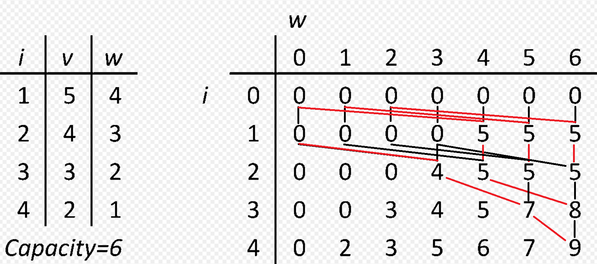

[toc]

# 배낭 문제란?

배낭에 담을 수 있는 무게의 최댓값이 정해져 있고, 일정 가치와 무게가 있는 짐들을 배낭에 넣을 때, 가치의 합이 최대가 되도록 짐을 고르는 방법을 찾는 문제.

+ **0-1 배낭문제**(0-1 knapsack problem): 짐을 쪼갤 수 없는 경우.
  동적계획법으로 풀이 가능.

+ **분할가능 배낭문제**(fractional knapsack problem)
  그리디 알고리즘으로 풀이 가능

> [배낭 문제 정의](https://en.wikipedia.org/wiki/Knapsack_problem#Definition)

여기서는 **분할 불가능 배낭문제에 대해서 다룬다**.

# 0-1 배낭 문제

+ $$A$$: 물건들의 집합.
+ $$B$$: 무게의 합은 $$W$$ 이하이면서 가치의 합은 최대가 되는 물건들의 집합.

$$B$$는 $$A$$의 부분집합이다. 부분집합의 경우의 수는 2^n^이다(이때 n은 $$n(A)$$). 따라서 무게가 $$W$$ 이하가 되는 경우의 수를 모두 따져보는 방법을 사용할 수 있다.

> 부분집합의 경우의 수가 2^n^인 이유는 모든 원소 각각은 부분집합에 포함되거나, 포함되지 않는 2가지 경우의 수를 가지기 때문이다.

```c
int knapsack(int i, int w) { // 집합 B안의 물건들의 가치합을 반환
	if (i == 0) return 0;
    // 현재 시점의 물건이 무게 제한 보다 무거우면 포함이 될 수 없음
    if (w < w[i]) return knapsack(i - 1, w);
    // 포함되지 않는 경우, 포함되는 경우
	return max(knapsack(i - 1, w), knapsack(i - 1, w - w[i]) + v[i]);
}
```

$$
\begin{align*}
&m[0, w] = 0\\
&m[i, w] = m[i - 1, w] \quad if \ w_i > w\\
&m[i, w] = max(m[i - 1, w], m[i - 1, w - w_i] + v_i) \quad if \ w_i \leqslant w
\end{align*}
$$

위의 알고리즘은 시간복잡도가 $$O(2^n)$$이므로 매우 느리다. 따라서 아래와 같이 다이나믹 프로그래밍 기법을 사용하여 시간복잡도를 $$O(NW)$$로 줄일 수 있다.





# BKP(Bounded Knapsack Problem)

0-1에서 각 물건이 하나만 있다는 조건을 제거했지만, 각 물건 $$a_i$$는 최대 $$n_i$$개의 갯수 제한이 있다.

# UKP(Unbounded Knapsack Problem)

BKP와 다르게 물건들은 개수 제한이 없다.

$$
\begin{align*}
&m[0, w] = 0\\
&m[i, w] = m[i - 1, w] \quad if \ w_i > w\\
&m[i, w] = max(m[i - 1, w], m[i, w - w_i] + v_i) \quad if \ w_i \leqslant w
\end{align*}
$$

or

$$
\begin{align*}
&m[0]\\
&m[w] = max(v_1 + m[w - w_1], v_2 + m[w - w_2], ..., v_n + m[w - w_n]),\ w_i \leqslant w \\
\end{align*}
$$

# 참고

+ [위키피디아](https://ko.wikipedia.org/wiki/%EB%B0%B0%EB%82%AD_%EB%AC%B8%EC%A0%9C)
+ **백준**: [12865번: 평범한 배낭](https://www.acmicpc.net/problem/12865)(0-1 배낭 문제)
+ [조합 최적화](https://en.wikipedia.org/wiki/Combinatorial_optimization)